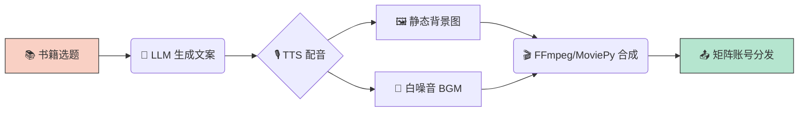

<div align="center">


# 🌙 Sleep Audiobook Video Generator

[](https://www.fuyegongfang.com)
[](https://www.python.org)
[](LICENSE)
[](https://github.com/5474312/sleep-audiobook-video)

> 🤖 AI 自动化生成“睡前听书/助眠”视频流水线。支持多账号矩阵、批量文案生成、TTS 配音和视频合成。

</div>

## 📖 简介
这是一个专为**短视频矩阵运营**设计的自动化工具。通过整合 LLM 文案生成、Edge-TTS 语音合成和 FFmpeg 视频处理，实现从“书籍选题”到“成品视频”的全流程自动化。

非常适合在 **抖音、快手、小红书、视频号** 等平台批量生产治愈系、助眠类、读书类内容。

## 🚀 核心功能
- **💡 智能文案**: 自动将书籍内容转化为“睡前电台”风格的治愈系口播稿。
- **🎙️ AI 配音**: 内置 10+ 种高质量中文音色（磁性男声、温柔女声、禅意童声）。
- **🎬 一键合成**: 自动匹配背景图、白噪音 BGM 和人声，生成 1080P 高清视频。
- **👥 矩阵管理**: 支持多账号差异化配置，轻松实现“一号一人设”的矩阵化运营。
- **⚡️ 极速渲染**: 针对服务器环境优化，避免复杂滤镜导致的超时问题。

## 🏗️ 架构流程



## 🛠️ 快速上手

### 1. 安装依赖
确保系统已安装 `python3` 和 `ffmpeg`。
```bash
# 安装 Python 依赖
pip install -r requirements.txt

# Ubuntu/Debian 安装 ffmpeg
sudo apt install ffmpeg -y
```

### 2. 运行 Demo
```bash
# 生成单条视频（默认使用《被讨厌的勇气》）
python3 scripts/generate_video.py

# 指定书名和音色
python3 scripts/generate_video.py --book "当下的力量" --account "深夜读书馆"
```

### 3. 批量生产
创建一个 `config.json` 文件：
```json
{
  "accounts": [
    {
      "name": "睡前听书助眠",
      "voice": "zh-CN-YunxiNeural",
      "bg_image": "assets/bg1.jpg",
      "bgm": "assets/rain.mp3"
    }
  ],
  "books": [
    { "title": "被讨厌的勇气" },
    { "title": "蛤蟆先生去看心理医生" }
  ]
}
```
执行批量任务：
```bash
python3 scripts/generate_video.py --batch config.json
```

## ⚙️ 环境要求
| 组件 | 最低版本 | 说明 |
|------|---------|------|
| Python | 3.8+ | 核心运行环境 |
| FFmpeg | 4.0+ | 视频合成引擎 |
| edge-tts | latest | 微软语音合成 API |
| moviepy | latest | 视频剪辑库 |

## 💡 老八避坑指南 (Server Pitfalls)
**来自服务器端实战的血泪经验总结：**

1. **🐢 渲染超时问题**: 避免在服务器使用复杂的 `zoompan` 动态滤镜（极慢且易超时）。**最佳实践**: 使用静态背景图 (`-tune stillimage`)，合成速度提升 10 倍！
2. **🌐 素材下载失败**: Unsplash/Pixabay 等图源常有反爬机制。**最佳实践**: 提前将高清背景图和白噪音下载到本地 `assets/` 目录，优先读取本地文件。
3. **🔑 GitHub 推送认证**: 服务器无交互终端，`gh auth login` 经常卡死。**最佳实践**: 使用 `git remote add origin https://<TOKEN>@github.com/...` 格式进行免交互推送。
4. **🔊 音频底噪**: Edge-TTS 生成的音频有时会有轻微底噪。**最佳实践**: 混音时将 BGM 音量调至 `0.10` - `0.15`，既掩盖底噪又不抢人声。

## 📦 项目结构
```text
sleep-audiobook-video/
├── SKILL.md              # 老八内部技能定义
├── README.md             # 本说明书
├── requirements.txt      # Python 依赖列表
├── config.json           # 批量任务配置示例
└── scripts/
    ├── generate_video.py # 🚀 核心流水线脚本
    └── auto_sleep_video.py # 📦 早期版本脚本
```

<div align="center">

Made with ❤️ by [**副业工坊**](https://www.fuyegongfang.com)

</div>
