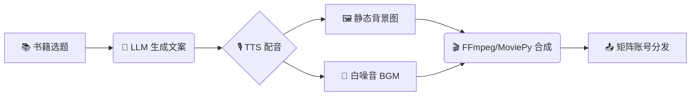

# Sleep Audiobook Video Generator

<div align="center">

[](https://www.fuyegongfang.com)

</div>

## 📖 简介
这是一个专为**短视频矩阵运营**设计的自动化工具。通过整合 LLM 文案生成、Edge-TTS 语音合成和 FFmpeg 视频处理，实现从“书籍选题”到“成品视频”的全流程自动化。

## 🚀 核心功能
- **💡 智能文案**: 自动将书籍内容转化为“睡前电台”风格的治愈系口播稿。
- **🎙️ AI 配音**: 内置 10+ 种高质量中文音色（磁性男声、温柔女声、禅意童声）。
- **🎬 一键合成**: 自动匹配背景图、白噪音 BGM 和人声，生成 1080P 高清视频。
- **👥 矩阵管理**: 支持多账号差异化配置，轻松实现“一号一人设”的矩阵化运营。
- **⚡️ 极速渲染**: 针对服务器环境优化，避免复杂滤镜导致的超时问题。

## 🏗️ 架构流程



## 🛠️ 使用方法

### 1. 快速上手
```bash
python3 scripts/generate_video.py --book "被讨厌的勇气"
```

### 2. 批量生成（生产模式）
```bash
python3 scripts/generate_video.py --batch config.json
```

### 3. 自定义配置
编辑 `config.json`：
```json
{
  "accounts": [
    {
      "name": "深夜读书馆",
      "voice": "zh-CN-YunxiNeural",
      "bgm": "assets/rain.mp3",
      "bg_image": "assets/night_reading.jpg"
    }
  ],
  "books": [
    { "title": "被讨厌的勇气", "style": "治愈、心理学" },
    { "title": "金刚经", "style": "禅修、空灵" }
  ]
}
```

## ⚙️ 环境要求
- Python 3.8+
- FFmpeg 已安装
- 依赖库：`edge-tts`, `moviepy`, `requests`, `pillow`

## 📦 安装依赖
```bash
pip install -r requirements.txt
```

## ⚠️ 注意事项
- 首次运行会自动下载 TTS 模型缓存。
- 确保有足够的磁盘空间（视频文件较大）。

## ⚡️ 服务器端避坑指南 (Server Pitfalls)
**老八实战总结：**
1. **FFmpeg `zoompan` 超时**: 在服务器上避免使用复杂的 `zoompan` 滤镜（极慢且易超时）。**推荐方案**：直接使用静态背景图 (`-tune stillimage`) 或简单的 `scale` 缩放，合成速度提升 10 倍。
2. **素材下载 403/超时**: Pixabay/Unsplash 等图源常有反爬或连接超时。**推荐方案**：批量任务前，先将 BGM 和背景图下载到本地 `assets/` 目录，脚本优先读取本地文件。
3. **GitHub 推送认证**: 服务器无交互终端，`gh auth login` 经常失败。**推荐方案**：使用 `git remote add origin https://<TOKEN>@github.com/...` 格式推送，稳定可靠。
